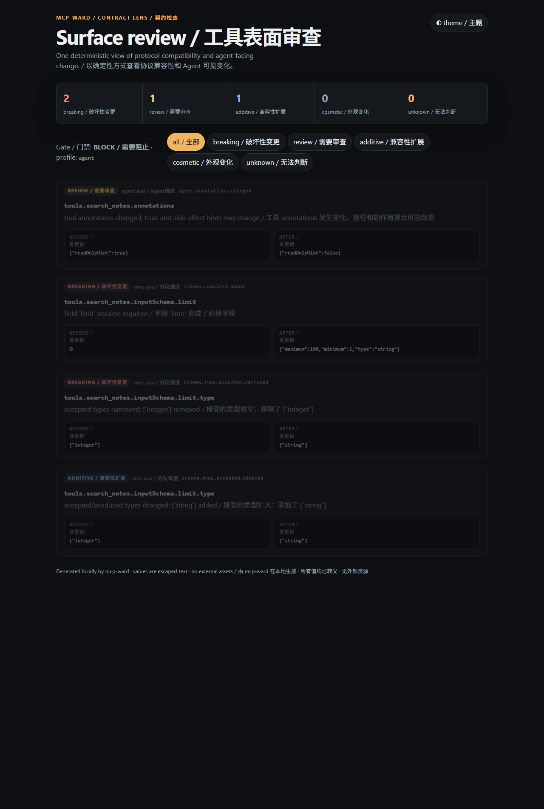

<!-- SPDX-License-Identifier: MIT -->
<!-- Copyright (c) 2026 Epho -->

<div align="center">

# mcp-ward · MCP 工具契约守门员

**[English](#english)** | **[中文](#中文)**

</div>

---

## English

# mcp-ward · MCP Tool Contract Guard

**Check the tool surface before the upgrade ships, not after the calls start failing.**

Give it two saved `tools/list` documents and it tells you what changed: which tools appeared or disappeared, which parameters became required, which types or enums narrowed, and which descriptions or safety annotations moved.

Zero dependencies, no account, no network at runtime. The HTML report is a single self-contained file you can open by double-clicking.

> **The idea:** an agent sees whatever schema a tool advertises today. A newly required argument, a removed tool, a rewritten description, or a flipped `readOnlyHint` can break callers or mislead a model *before* the code reaches production. Make that surface reviewable as data, in a pull request or a release gate.

It is an independent offline lens. It does **not** start an MCP server, execute tools, or replace runtime security controls.

###  📸 Preview



Bilingual (`--lang both`): every label carries both languages, and the Chinese half is marked `lang="zh-CN"` so screen readers switch voice.

###  🎯 What It Detects

- ** 🔧 Tool Lifecycle**: addition, removal, description and title drift
- ** 📐 Schema Shape**: required-property additions, optionality changes, property add/remove
- ** 🎯 Type & Enum**: type-set narrowing and widening, enum value changes, array `items`
- ** 🔒 Constraints**: numeric bounds, string bounds, nullability, `additionalProperties`
- ** ⚠️ Annotations**: `readOnlyHint`, `destructiveHint`, `idempotentHint`, `openWorldHint`
- ** ❓ Unknown**: anything outside the v0.1 projection, reported fail-closed

###  ❓ Fail-Closed by Design

Unknown keys are preserved in snapshots and never treated as safe. A changed top-level tool key reports `wire.unknown.changed`; a changed unsupported schema keyword (`$ref`, `allOf`, `anyOf`, `oneOf`, `pattern`, `format`, …) reports `schema.unsupported.changed`.

Both carry the `unknown` impact, which blocks `wire`, `agent`, and `strict`. Only `observe` passes it.

```text
unknown means "outside the projection", not "this change is fine".
```

###  🚪 Profiles

A profile is a consumer boundary, not a hidden override of findings. One finding stream feeds every gate.

| | Profile | Blocks |
| --- | --- | --- |
| 👁️ | `observe` | nothing; report everything |
| 🔌 | `wire` | protocol/caller breakage and `unknown` changes |
| 🤖 | `agent` | wire breakage + agent-review trust-surface changes + `unknown` (default) |
| 🛡️ | `strict` | every finding, including additive and cosmetic drift |

###  🚀 Usage

```bash
pip install mcp-ward
```

Requires Python 3.10+. No runtime dependencies.

```bash
# capture a deterministic snapshot
mcp-ward snapshot tools-list.json -o baseline.json

# compare, and fail CI on wire-level breakage
mcp-ward check baseline.json candidate.json --profile wire

# produce a self-contained report
mcp-ward check baseline.json candidate.json \
  --profile agent --format text,json,html --report-dir reports/
```

Exit codes: `0` accepted · `1` the profile blocked the change · `2` invalid input or usage.

Compare against a committed baseline without copying it out of git:

```bash
mcp-ward check --baseline-ref main:baseline.json --candidate tools-list.json --profile agent
```

###  🌍 Bilingual Output

```bash
mcp-ward check baseline.json candidate.json \
  --lang both --format text,json,html --report-dir reports/
```

`en` (default) · `zh` · `both`. Only mcp-ward's own wording is translated — tool names, parameter names, descriptions, paths, and user input pass through untouched, and an unrecognised finding code falls back to its original English message.

**JSON stays language-neutral.** The same three language modes produce byte-identical JSON, so CI and agent consumers keep stable machine keys.

###  🧩 Python API

```python
from mcp_ward import DiffReport, diff_surfaces, load_document

before = load_document("baseline.json")
after = load_document("candidate.json")
report = DiffReport(diff_surfaces(before, after))

for finding in report.findings:
    print(f"[{finding.impact}] {finding.path}: {finding.message}")
```

###  📄 License

```
SPDX-License-Identifier: MIT
Copyright (c) 2026 Epho
```

MIT — see [LICENSE](LICENSE).

###  👤 Author

- Xiaohongshu / Rednote：@Epho
- GitHub：https://github.com/EphoReal

---

## 中文

# mcp-ward · MCP 工具契约守门员

**在升级上线之前检查工具表面，而不是等调用开始失败之后。**

给它两份保存下来的 `tools/list` 文档，它就告诉你变了什么：哪些工具新增或删除、
哪些参数变成了必填、哪些类型或枚举收窄了、哪些描述或安全标注发生了变化。

零依赖、不需要账号、运行时完全不联网。HTML 报告是单文件自包含的，双击就能打开。

> **核心想法：** Agent 看到的是工具「今天声明的」schema。一个参数变成必填、
> 一个工具被删除、一段描述被改写、一个 `readOnlyHint` 被翻转，都可能在代码上线
> **之前**就破坏调用方或误导模型。把这份对外表面变成可评审的数据，放进 Pull
> Request 或发布卡点里。

它是一个独立离线的检查工具，**不会**启动 MCP Server、不会执行工具，也不会替代
运行时的安全控制。

###  📸 预览


双语（`--lang both`）：每个标签都带两种语言，中文那半边标了 `lang="zh-CN"`，屏幕阅读器会自动切换语音。

###  🎯 能检测什么

- ** 🔧 工具增删**:新增、删除、描述与标题漂移
- ** 📐 结构变化**:必填属性新增、可选性变化、属性增删
- ** 🎯 类型与枚举**:类型集合收窄与扩大、枚举值变化、数组 `items`
- ** 🔒 约束**:数值边界、字符串边界、可空性、`additionalProperties`
- ** ⚠️ 标注**:`readOnlyHint`、`destructiveHint`、`idempotentHint`、`openWorldHint`
- ** ❓ 无法判断**:一切落在 0.1 投影之外的变化，一律 fail-closed

###  ❓ 保守优先的设计

未知字段会保留在快照里，绝不被默默当作安全。工具顶层键变化报
`wire.unknown.changed`；受支持投影之外的 schema 关键字（`$ref`、`allOf`、
`anyOf`、`oneOf`、`pattern`、`format`……）变化报 `schema.unsupported.changed`。

两者都带 `unknown` 影响级别，会拦下 `wire`、`agent` 和 `strict`，只有 `observe`
放行。

```text
unknown means "outside the projection", not "this change is fine".
```

###  🚪 策略 Profile

profile 是消费方边界，不是对 finding 的隐藏覆盖。一份 finding 流喂给所有卡点。

| | Profile | 拦截什么 |
| --- | --- | --- |
| 👁️ | `observe` | 什么都不拦；全部报告 |
| 🔌 | `wire` | 协议／调用方层面的破坏和 `unknown` 变化 |
| 🤖 | `agent` | 在 `wire` 之上，额外拦 Agent 评审级的信任面变化和 `unknown`（默认） |
| 🛡️ | `strict` | 每一条 finding，包括兼容性扩展和外观漂移 |

###  🚀 使用方式

```bash
pip install mcp-ward
```

需要 Python 3.10 及以上，没有任何运行时依赖。

```bash
# capture a deterministic snapshot
mcp-ward snapshot tools-list.json -o baseline.json

# compare, and fail CI on wire-level breakage
mcp-ward check baseline.json candidate.json --profile wire

# produce a self-contained report
mcp-ward check baseline.json candidate.json \
  --profile agent --format text,json,html --report-dir reports/
```

退出码：`0` 通过 · `1` 被所选 profile 拦下 · `2` 输入或用法无效。

不用把 baseline 从 git 里拷出来，也能直接比对已提交的版本：

```bash
mcp-ward check --baseline-ref main:baseline.json --candidate tools-list.json --profile agent
```

###  🌍 双语报告

```bash
mcp-ward check baseline.json candidate.json \
  --lang both --format text,json,html --report-dir reports/
```

`en`（默认）· `zh` · `both`。只翻译 mcp-ward 自己的措辞——工具名、参数名、描述、
路径和用户输入原样透传；无法识别的 finding code 会回退到原始英文消息。

**JSON 保持语言中立。** 同样的三种语言模式产出逐字节相同的 JSON，所以 CI 和
Agent 消费方拿到的机器字段始终稳定。

###  🧩 Python API

```python
from mcp_ward import DiffReport, diff_surfaces, load_document

before = load_document("baseline.json")
after = load_document("candidate.json")
report = DiffReport(diff_surfaces(before, after))

for finding in report.findings:
    print(f"[{finding.impact}] {finding.path}: {finding.message}")
```


###  📄 许可

```
SPDX-License-Identifier: MIT
Copyright (c) 2026 Epho
```

MIT — 见 [LICENSE](LICENSE)。

###  👤 作者

- Xiaohongshu / Rednote：@Epho
- GitHub：https://github.com/EphoReal
